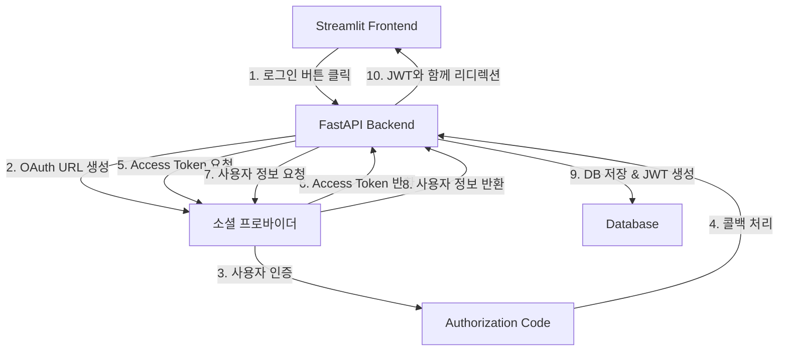

# 소셜 로그인 구현 가이드 (FastAPI + Streamlit)

이 가이드는 FastAPI 백엔드와 Streamlit 프론트엔드를 사용하여 소셜 로그인을 구현하는 완전한 A-Z 가이드입니다.

## 📋 목차

1. [개요](#개요)
2. [전체 아키텍처](#전체-아키텍처)
3. [환경 설정](#환경-설정)
4. [백엔드 구현](#백엔드-구현)
5. [프론트엔드 구현](#프론트엔드-구현)
6. [각 소셜 프로바이더 설정](#각-소셜-프로바이더-설정)
7. [보안 고려사항](#보안-고려사항)
8. [문제 해결](#문제-해결)

## 개요

### 지원하는 소셜 프로바이더
- **Google** (OAuth 2.0)
- **Kakao** (OAuth 2.0)
- **Naver** (OAuth 2.0)

### 기술 스택
- **백엔드**: FastAPI, SQLAlchemy, httpx
- **프론트엔드**: Streamlit
- **인증**: JWT (JSON Web Token)
- **세션 관리**: Starlette SessionMiddleware

## 전체 아키텍처



### 동작 흐름
1. **프론트엔드**: 사용자가 소셜 로그인 버튼 클릭
2. **백엔드**: OAuth URL 생성 및 리디렉션
3. **소셜 프로바이더**: 사용자 인증 후 Authorization Code 반환
4. **백엔드**: Authorization Code를 Access Token으로 교환
5. **백엔드**: Access Token으로 사용자 정보 조회
6. **백엔드**: 사용자 정보를 DB에 저장하고 JWT 토큰 생성
7. **백엔드**: JWT 토큰과 함께 프론트엔드로 리디렉션
8. **프론트엔드**: JWT 토큰으로 로그인 상태 관리

## 환경 설정

### 1. 필요한 패키지 설치

```bash
# 백엔드 의존성
pip install fastapi uvicorn sqlalchemy httpx python-jose[cryptography] python-multipart

# 프론트엔드 의존성
pip install streamlit requests
```

### 2. 환경 변수 설정 (.env.local)

```env
# JWT 설정
JWT_SECRET_KEY=your_super_secret_jwt_key_here
JWT_ALGORITHM=HS256
ACCESS_TOKEN_EXPIRE_MINUTES=30

# Google OAuth
GOOGLE_CLIENT_ID=your_google_client_id
GOOGLE_CLIENT_SECRET=your_google_client_secret
GOOGLE_REDIRECT_URI=http://localhost:8001/auth/google/callback

# Kakao OAuth
KAKAO_REST_API_KEY=your_kakao_rest_api_key
KAKAO_CLIENT_SECRET=your_kakao_client_secret
KAKAO_REDIRECT_URI=http://localhost:8001/auth/kakao/callback

# Naver OAuth
NAVER_CLIENT_ID=your_naver_client_id
NAVER_CLIENT_SECRET=your_naver_client_secret
NAVER_REDIRECT_URI=http://localhost:8001/auth/naver/callback

# 애플리케이션 URL
API_URL=http://localhost:8001
STREAMLIT_APP_URL=http://localhost:8501

# 세션 키
SESSION_SECRET_KEY=your_session_secret_key
```

## 백엔드 구현

### 1. 프로젝트 구조

```
backend/
├── routes/
│   └── social_routes.py      # 소셜 로그인 라우터
├── database/
│   ├── models.py             # User 모델
│   └── database.py           # DB 연결
├── controllers/
│   └── users_controllers.py  # 사용자 관리 로직
├── utils/
│   ├── auth.py               # JWT 관련 함수
│   └── validation.py         # 입력 검증
├── models/
│   └── schemas.py            # Pydantic 스키마
└── main.py                   # FastAPI 앱
```

### 2. 사용자 모델 (database/models.py)

```python
from sqlmodel import SQLModel, Field
from typing import Optional
from datetime import datetime

class User(SQLModel, table=True):
    __tablename__ = "users"
    
    id: Optional[int] = Field(default=None, primary_key=True)
    email: str = Field(unique=True, index=True)
    username: str = Field(unique=True, index=True)
    name: Optional[str] = None
    hashed_password: str
    is_active: bool = Field(default=True)
    is_verified: bool = Field(default=False)
    created_at: Optional[datetime] = Field(default_factory=datetime.utcnow)
    
    # OAuth 필드 (각 프로바이더별 고유 ID)
    google_id: Optional[str] = Field(default=None, unique=True)
    naver_id: Optional[str] = Field(default=None, unique=True)
    kakao_id: Optional[str] = Field(default=None, unique=True)
```

### 3. JWT 유틸리티 (utils/auth.py)

```python
import os
from datetime import datetime, timedelta
from typing import Optional, Dict, Any
import jwt
from fastapi import HTTPException, status, Depends
from fastapi.security import HTTPBearer, HTTPAuthorizationCredentials

JWT_SECRET_KEY = os.getenv("JWT_SECRET_KEY")
JWT_ALGORITHM = os.getenv("JWT_ALGORITHM", "HS256")
JWT_EXPIRE_MINUTES = int(os.getenv("JWT_EXPIRE_MINUTES", "60"))

security = HTTPBearer()

def create_jwt_token(data: Dict[str, Any]) -> str:
    """JWT 토큰 생성"""
    to_encode = data.copy()
    expire = datetime.utcnow() + timedelta(minutes=JWT_EXPIRE_MINUTES)
    to_encode.update({"exp": expire})
    
    return jwt.encode(to_encode, JWT_SECRET_KEY, algorithm=JWT_ALGORITHM)

def verify_jwt_token(token: str) -> Dict[str, Any]:
    """JWT 토큰 검증"""
    try:
        payload = jwt.decode(token, JWT_SECRET_KEY, algorithms=[JWT_ALGORITHM])
        return payload
    except jwt.ExpiredSignatureError:
        raise HTTPException(
            status_code=status.HTTP_401_UNAUTHORIZED,
            detail="토큰이 만료되었습니다"
        )
    except jwt.JWTError:
        raise HTTPException(
            status_code=status.HTTP_401_UNAUTHORIZED,
            detail="유효하지 않은 토큰입니다"
        )

def get_current_user(credentials: HTTPAuthorizationCredentials = Depends(security)):
    """현재 로그인한 사용자 정보 가져오기"""
    token = credentials.credentials
    payload = verify_jwt_token(token)
    # 여기서 payload로부터 사용자 정보를 조회
    return payload
```

### 4. 사용자 컨트롤러 (controllers/users_controllers.py)

```python
from sqlalchemy.orm import Session
from database.models import User
from typing import Optional
import logging

logger = logging.getLogger(__name__)

class UserController:
    @staticmethod
    def create_or_update_social_user(db: Session, provider: str, user_info: dict) -> User:
        """소셜 로그인으로부터 사용자 생성 또는 업데이트"""
        provider_id = str(user_info.get("provider_id")).strip()
        email = user_info.get("email", "").strip() if user_info.get("email") else None
        name = user_info.get("name", "").strip() if user_info.get("name") else None
        
        logger.info(f"{provider} 사용자 처리 시작: provider_id={provider_id}, email={email}")
        
        try:
            # 1. 프로바이더 ID로 기존 사용자 찾기
            provider_id_field = f"{provider}_id"
            user = db.query(User).filter(getattr(User, provider_id_field) == provider_id).first()
            
            if user:
                logger.info(f"기존 {provider} 사용자 발견: {user.email}")
                # 기존 사용자 정보 업데이트
                if name and user.name != name:
                    user.name = name
                    db.commit()
                return user

            # 2. 이메일로 기존 사용자 찾아서 연결
            if email:
                user = db.query(User).filter(User.email == email).first()
                if user:
                    logger.info(f"이메일로 기존 사용자 발견, {provider} 연결: {email}")
                    setattr(user, provider_id_field, provider_id)
                    if name and user.name != name:
                        user.name = name
                    db.commit()
                    return user

            # 3. 새 사용자 생성
            if not email:
                raise ValueError("소셜 로그인에서 이메일 정보를 제공하지 않았습니다.")

            username = email.split('@')[0]  # 이메일 앞부분을 username으로 사용
            
            new_user_data = {
                "email": email,
                "username": username,
                "name": name,
                provider_id_field: provider_id,
                "is_verified": True,
                "is_active": True,
                "hashed_password": ""  # 소셜 로그인은 비밀번호 불필요
            }
            
            user = User(**new_user_data)
            db.add(user)
            db.commit()
            db.refresh(user)
            
            logger.info(f"{provider} 새 사용자 생성 완료: {user.email}, ID: {user.id}")
            return user
            
        except Exception as e:
            logger.error(f"{provider} 사용자 생성/업데이트 오류: {e}")
            raise
```

### 5. 소셜 로그인 라우터 (routes/social_routes.py)

```python
import os
import logging
from typing import Optional
from uuid import uuid4

import httpx
from fastapi import APIRouter, Request, Depends, HTTPException
from fastapi.responses import RedirectResponse
from sqlalchemy.orm import Session

from database.database import get_db
from database.models import User
from controllers.users_controllers import UserController
from utils.auth import create_jwt_token
from models.schemas import User as UserSchema

router = APIRouter()  # OAuth 라우터
auth_router = APIRouter()  # Auth API 라우터

logger = logging.getLogger(__name__)

# OAuth Endpoints
GOOGLE_AUTH_URL = "https://accounts.google.com/o/oauth2/v2/auth"
GOOGLE_TOKEN_URL = "https://oauth2.googleapis.com/token"
GOOGLE_USERINFO_URL = "https://www.googleapis.com/oauth2/v2/userinfo"

KAKAO_AUTH_URL = "https://kauth.kakao.com/oauth/authorize"
KAKAO_TOKEN_URL = "https://kauth.kakao.com/oauth/token"
KAKAO_USERINFO_URL = "https://kapi.kakao.com/v2/user/me"

NAVER_AUTH_URL = "https://nid.naver.com/oauth2.0/authorize"
NAVER_TOKEN_URL = "https://nid.naver.com/oauth2.0/token"
NAVER_USERINFO_URL = "https://openapi.naver.com/v1/nid/me"

# 환경변수
GOOGLE_CLIENT_ID = os.getenv("GOOGLE_CLIENT_ID")
GOOGLE_CLIENT_SECRET = os.getenv("GOOGLE_CLIENT_SECRET")
GOOGLE_REDIRECT_URI = os.getenv("GOOGLE_REDIRECT_URI")

KAKAO_REST_API_KEY = os.getenv("KAKAO_REST_API_KEY")
KAKAO_CLIENT_SECRET = os.getenv("KAKAO_CLIENT_SECRET")
KAKAO_REDIRECT_URI = os.getenv("KAKAO_REDIRECT_URI")

NAVER_CLIENT_ID = os.getenv("NAVER_CLIENT_ID")
NAVER_CLIENT_SECRET = os.getenv("NAVER_CLIENT_SECRET")
NAVER_REDIRECT_URI = os.getenv("NAVER_REDIRECT_URI")

STREAMLIT_APP_URL = os.getenv("STREAMLIT_APP_URL", "http://localhost:8501")
SUPPORTED_PROVIDERS = {"google", "kakao", "naver"}

@router.get("/{provider}")
async def login(provider: str, request: Request):
    """OAuth 로그인 시작"""
    logger.info(f"🚀 OAuth 로그인 시작: provider={provider}")
    
    if provider not in SUPPORTED_PROVIDERS:
        raise HTTPException(status_code=400, detail="Unsupported provider")

    # CSRF 방지를 위한 state 생성
    state = str(uuid4())
    request.session["oauth_state"] = state
    
    # 각 프로바이더별 OAuth URL 생성
    if provider == "google":
        redirect_url = (
            f"{GOOGLE_AUTH_URL}?"
            f"client_id={GOOGLE_CLIENT_ID}&"
            f"redirect_uri={GOOGLE_REDIRECT_URI}&"
            f"response_type=code&"
            f"scope=openid%20email%20profile&"
            f"access_type=offline&"
            f"state={state}"
        )
    elif provider == "kakao":
        redirect_url = (
            f"{KAKAO_AUTH_URL}?"
            f"client_id={KAKAO_REST_API_KEY}&"
            f"redirect_uri={KAKAO_REDIRECT_URI}&"
            f"response_type=code&"
            f"state={state}"
        )
    elif provider == "naver":
        redirect_url = (
            f"{NAVER_AUTH_URL}?"
            f"client_id={NAVER_CLIENT_ID}&"
            f"redirect_uri={NAVER_REDIRECT_URI}&"
            f"response_type=code&"
            f"state={state}"
        )
    
    return RedirectResponse(redirect_url)

@router.get("/{provider}/callback")
async def auth_callback(
    provider: str,
    code: Optional[str] = None,
    state: Optional[str] = None,
    error: Optional[str] = None,
    error_description: Optional[str] = None,
    request: Request = None,
    db: Session = Depends(get_db)
):
    """OAuth 콜백 처리"""
    logger.info(f"📞 OAuth 콜백 받음: provider={provider}")
    
    # 에러 처리
    if error:
        logger.error(f"❌ OAuth 에러: {error} - {error_description}")
        redirect_url = f"{STREAMLIT_APP_URL}?login=error&error={error}"
        return RedirectResponse(url=redirect_url)
    
    # Authorization code 확인
    if not code:
        logger.error("❌ Authorization code가 없습니다")
        redirect_url = f"{STREAMLIT_APP_URL}?login=error&error=no_code"
        return RedirectResponse(url=redirect_url)
    
    # State 검증 (CSRF 방지)
    saved_state = request.session.get("oauth_state")
    if state != "null" and (not saved_state or saved_state != state):
        logger.error(f"❌ State 불일치")
        redirect_url = f"{STREAMLIT_APP_URL}?login=error&error=invalid_state"
        return RedirectResponse(url=redirect_url)

    try:
        # 1. Access Token 요청
        if provider == "google":
            token_url = GOOGLE_TOKEN_URL
            token_data = {
                "code": code,
                "client_id": GOOGLE_CLIENT_ID,
                "client_secret": GOOGLE_CLIENT_SECRET,
                "redirect_uri": GOOGLE_REDIRECT_URI,
                "grant_type": "authorization_code"
            }
            userinfo_url = GOOGLE_USERINFO_URL
        elif provider == "kakao":
            token_url = KAKAO_TOKEN_URL
            token_data = {
                "code": code,
                "client_id": KAKAO_REST_API_KEY,
                "client_secret": KAKAO_CLIENT_SECRET,
                "redirect_uri": KAKAO_REDIRECT_URI,
                "grant_type": "authorization_code"
            }
            userinfo_url = KAKAO_USERINFO_URL
        elif provider == "naver":
            token_url = NAVER_TOKEN_URL
            token_data = {
                "code": code,
                "client_id": NAVER_CLIENT_ID,
                "client_secret": NAVER_CLIENT_SECRET,
                "redirect_uri": NAVER_REDIRECT_URI,
                "grant_type": "authorization_code",
                "state": state
            }
            userinfo_url = NAVER_USERINFO_URL

        # Access Token 요청
        async with httpx.AsyncClient() as client:
            token_res = await client.post(token_url, data=token_data)
            token_res.raise_for_status()
            access_token = token_res.json().get("access_token")

        # 2. 사용자 정보 요청
        headers = {"Authorization": f"Bearer {access_token}"}
        async with httpx.AsyncClient() as client:
            userinfo_res = await client.get(userinfo_url, headers=headers)
            userinfo_res.raise_for_status()
            profile_data = userinfo_res.json()

        # 3. 각 프로바이더별 사용자 정보 파싱
        if provider == "naver":
            profile_data = profile_data.get("response", {})
            user_info = {
                "provider_id": str(profile_data.get("id")),
                "email": profile_data.get("email"),
                "name": profile_data.get("name") or profile_data.get("nickname"),
            }
        elif provider == "kakao":
            kakao_account = profile_data.get("kakao_account", {})
            profile = kakao_account.get("profile", {})
            user_info = {
                "provider_id": str(profile_data.get("id")),
                "email": kakao_account.get("email"),
                "name": profile.get("nickname"),
            }
        elif provider == "google":
            user_info = {
                "provider_id": str(profile_data.get("id")),
                "email": profile_data.get("email"),
                "name": profile_data.get("name"),
            }

        # 4. 사용자 생성 또는 업데이트
        user = UserController.create_or_update_social_user(
            db=db, provider=provider, user_info=user_info
        )

        # 5. JWT 토큰 생성
        provider_id_field = f"{provider}_id"
        provider_user_id = getattr(user, provider_id_field, None)
        
        jwt_token = create_jwt_token({
            "sub": str(user.id),
            "provider_id": str(provider_user_id) if provider_user_id else str(user.id),
            "nickname": user.name,
            "email": user.email,
            "provider": provider
        })

        # 6. 세션 정리 및 리디렉션
        request.session.pop("oauth_state", None)
        redirect_url = f"{STREAMLIT_APP_URL}?token={jwt_token}&login=success"
        
        logger.info(f"🎯 로그인 성공, Streamlit으로 리디렉션")
        return RedirectResponse(url=redirect_url, status_code=303)

    except Exception as e:
        logger.error(f"💥 OAuth 처리 중 오류: {str(e)}")
        redirect_url = f"{STREAMLIT_APP_URL}?login=error&error=processing_failed"
        return RedirectResponse(url=redirect_url)

# 인증 API 엔드포인트
@auth_router.get("/me", response_model=UserSchema)
async def read_users_me(current_user: User = Depends(get_current_user)):
    """현재 로그인한 사용자 정보 반환"""
    return current_user
```

### 6. 메인 애플리케이션 (main.py)

```python
from fastapi import FastAPI
from fastapi.middleware.cors import CORSMiddleware
from starlette.middleware.sessions import SessionMiddleware
import os

from routes import social_routes

app = FastAPI(title="Auto ML API", version="1.0.0")

# CORS 설정
app.add_middleware(
    CORSMiddleware,
    allow_origins=[
        "http://localhost:8501",  # Streamlit
        "http://localhost:8001",  # FastAPI
        "http://127.0.0.1:8501",
        "http://127.0.0.1:8001",
    ],
    allow_credentials=True,
    allow_methods=["GET", "POST", "DELETE", "OPTIONS", "PUT"],
    allow_headers=["*"],
    expose_headers=["*"]
)

# 세션 미들웨어 (OAuth state 관리용)
SESSION_SECRET_KEY = os.getenv("SESSION_SECRET_KEY") or os.getenv("JWT_SECRET_KEY")
app.add_middleware(
    SessionMiddleware,
    secret_key=SESSION_SECRET_KEY,
    session_cookie="app_session",
    max_age=3600,
    same_site="lax",
    https_only=False  # 개발환경에서는 False
)

# 라우터 등록
app.include_router(social_routes.router, prefix="/auth", tags=["social authentication"])
app.include_router(social_routes.auth_router, prefix="/api/auth", tags=["authentication"])

@app.get("/")
async def root():
    return {"message": "Auto ML API is running", "version": "1.0.0"}

if __name__ == "__main__":
    import uvicorn
    uvicorn.run("main:app", host="0.0.0.0", port=8001, reload=True)
```

## 프론트엔드 구현

### 1. 메인 애플리케이션 (app.py)

```python
import streamlit as st
import requests
import os
from typing import Optional, Dict, Any

# API 설정
API_URL = os.getenv("API_URL", "http://localhost:8001")

class APIClient:
    def __init__(self):
        pass

    def get_headers(self) -> dict:
        """인증 헤더 가져오기"""
        if st.session_state.get('access_token'):
            return {"Authorization": f"Bearer {st.session_state.access_token}"}
        return {}

    def make_api_request(self, endpoint: str, method: str = "GET", data: dict = None):
        """API 요청 생성"""
        url = f"{API_URL}/api{endpoint}"
        headers = self.get_headers()
        
        try:
            if method == "GET":
                response = requests.get(url, headers=headers)
            elif method == "POST":
                response = requests.post(url, headers=headers, json=data)
            
            if response.status_code == 401:
                st.session_state.authenticated = False
                st.session_state.access_token = None
                st.error("세션이 만료되었습니다. 다시 로그인해주세요.")
                st.rerun()
            
            return response
        except requests.exceptions.RequestException as e:
            st.error(f"API 요청 실패: {e}")
            return None

def initialize_session_state():
    """세션 상태 초기화"""
    if 'authenticated' not in st.session_state:
        st.session_state.authenticated = False
    if 'access_token' not in st.session_state:
        st.session_state.access_token = None
    if 'user_info' not in st.session_state:
        st.session_state.user_info = None

def render_welcome_page():
    """환영 페이지"""
    st.title("Auto ML 플랫폼에 오신 것을 환영합니다! 🤖")
    
    from pages._login import login_page
    login_page()

def main():
    """메인 애플리케이션"""
    initialize_session_state()
    
    st.set_page_config(
        page_title="Auto ML 플랫폼",
        page_icon="🤖",
        layout="wide",
        initial_sidebar_state="expanded"
    )

    # URL 파라미터에서 토큰 처리
    params = st.query_params
    if "login" in params:
        login_status = params.get("login")
        if login_status == "success" and "token" in params:
            token = params["token"]
            st.session_state.authenticated = True
            st.session_state.access_token = token
            
            # 사용자 정보 가져오기
            api_client = APIClient()
            user_response = api_client.make_api_request("/auth/me")
            if user_response and user_response.status_code == 200:
                st.session_state.user_info = user_response.json()
                st.session_state.login_success_message = f"✅ 로그인 성공! 환영합니다, {st.session_state.user_info.get('name', '사용자')}님!"
            else:
                st.error("사용자 정보를 가져오는데 실패했습니다.")
                st.session_state.authenticated = False
            
            st.query_params.clear()
            st.rerun()
            
        elif login_status == "error":
            error = params.get("error", "unknown")
            st.error(f"로그인 실패: {error}")
            st.query_params.clear()

    # 로그인 성공 메시지 표시
    if st.session_state.get("login_success_message"):
        st.success(st.session_state.login_success_message)
        st.balloons()
        del st.session_state.login_success_message

    # 페이지 라우팅
    if st.session_state.get("authenticated"):
        # 로그인된 사용자 화면
        st.sidebar.success(f"환영합니다, {st.session_state.user_info.get('name', '사용자')}님!")
        
        if st.sidebar.button("🔓 로그아웃"):
            st.session_state.authenticated = False
            st.session_state.access_token = None
            st.session_state.user_info = None
            st.rerun()
        
        st.title("대시보드")
        st.write("로그인이 성공적으로 완료되었습니다!")
    else:
        # 비로그인 사용자 화면
        render_welcome_page()

if __name__ == "__main__":
    main()
```

### 2. 로그인 페이지 (pages/_login.py)

```python
import streamlit as st
import os

API_URL = os.getenv("API_URL", "http://localhost:8001")

def login_page():
    """소셜 로그인 페이지"""
    st.subheader("소셜 계정으로 로그인")
    st.markdown("보안과 편의성을 위해 소셜 로그인만 지원합니다.")
    
    # 소셜 로그인 버튼
    col1, col2, col3 = st.columns(3)
    
    with col1:
        if st.button("Google 계정으로 로그인", key="google_login", use_container_width=True):
            google_url = f"{API_URL}/auth/google"
            st.markdown(f'<meta http-equiv="refresh" content="0;url={google_url}">', unsafe_allow_html=True)

    with col2:
        if st.button("카카오 계정으로 로그인", key="kakao_login", use_container_width=True):
            kakao_url = f"{API_URL}/auth/kakao"
            st.markdown(f'<meta http-equiv="refresh" content="0;url={kakao_url}">', unsafe_allow_html=True)

    with col3:
        if st.button("네이버 계정으로 로그인", key="naver_login", use_container_width=True):
            naver_url = f"{API_URL}/auth/naver"
            st.markdown(f'<meta http-equiv="refresh" content="0;url={naver_url}">', unsafe_allow_html=True)
```

## 각 소셜 프로바이더 설정

### Google OAuth 설정

1. **Google Cloud Console** (https://console.cloud.google.com/) 접속
2. **새 프로젝트 생성** 또는 기존 프로젝트 선택
3. **APIs & Services** → **Credentials** 클릭
4. **+ CREATE CREDENTIALS** → **OAuth 2.0 Client IDs** 선택
5. **Application type**: Web application
6. **Name**: 애플리케이션 이름 입력
7. **Authorized redirect URIs**:
   - `http://localhost:8001/auth/google/callback` 추가
8. **CREATE** 클릭 후 **Client ID**와 **Client Secret** 복사

#### OAuth 동의 화면 설정
1. **OAuth consent screen** 탭 클릭
2. **User Type**: External 선택
3. **App name**, **User support email**, **Developer contact information** 입력
4. **Scopes**: `email`, `profile`, `openid` 추가
5. **Test users**에 테스트할 이메일 주소 추가

### Kakao OAuth 설정

1. **Kakao Developers** (https://developers.kakao.com/) 접속
2. **내 애플리케이션** → **애플리케이션 추가하기**
3. **앱 이름** 및 **회사명** 입력
4. **애플리케이션 생성** 후 **앱 키** 복사 (REST API 키)

#### 플랫폼 설정
1. **앱 설정** → **플랫폼** → **Web 플랫폼 등록**
2. **사이트 도메인**: `http://localhost:8001` 입력

#### 카카오 로그인 설정
1. **제품 설정** → **카카오 로그인** → **활성화 설정** ON
2. **Redirect URI**: `http://localhost:8001/auth/kakao/callback` 등록
3. **동의항목** → **이메일**, **닉네임** 필수 동의로 설정

### Naver OAuth 설정

1. **네이버 개발자센터** (https://developers.naver.com/) 접속
2. **Application** → **애플리케이션 등록**
3. **애플리케이션 이름** 입력
4. **사용 API**: 네이버 로그인 선택

#### 서비스 환경 설정
1. **PC 웹**:
   - **서비스 URL**: `http://localhost:8001`
   - **네이버아이디로로그인 Callback URL**: `http://localhost:8001/auth/naver/callback`

#### 제공 정보 선택
1. **이메일 주소** (필수)
2. **닉네임** (필수)
3. 기타 필요한 정보 선택

## 보안 고려사항

### 1. CSRF 방지
- **State 파라미터** 사용으로 CSRF 공격 방지
- 세션에 임시 state 값 저장 후 콜백에서 검증

### 2. JWT 토큰 보안
```python
# 강력한 시크릿 키 사용
JWT_SECRET_KEY = "매우_복잡하고_긴_시크릿_키_256비트_이상"

# 적절한 만료 시간 설정
JWT_EXPIRE_MINUTES = 60  # 1시간

# 토큰 재사용 방지를 위한 추가 클레임
def create_jwt_token(data: Dict[str, Any]) -> str:
    to_encode = data.copy()
    expire = datetime.utcnow() + timedelta(minutes=JWT_EXPIRE_MINUTES)
    to_encode.update({
        "exp": expire,
        "iat": datetime.utcnow(),  # 발급 시간
        "jti": str(uuid4())       # JWT ID (토큰 고유 식별자)
    })
    return jwt.encode(to_encode, JWT_SECRET_KEY, algorithm=JWT_ALGORITHM)
```

### 3. 세션 보안
```python
# 세션 미들웨어 보안 설정
app.add_middleware(
    SessionMiddleware,
    secret_key=SESSION_SECRET_KEY,
    session_cookie="app_session",
    max_age=3600,           # 1시간 후 만료
    same_site="lax",        # CSRF 방지
    https_only=True,        # 프로덕션에서는 True
    httponly=True          # XSS 방지
)
```

### 4. 환경 변수 관리
- **절대로** 시크릿 키를 코드에 하드코딩하지 말 것
- `.env` 파일을 `.gitignore`에 추가
- 프로덕션에서는 환경 변수나 시크릿 관리 서비스 사용

### 5. HTTPS 사용
- 프로덕션 환경에서는 반드시 HTTPS 사용
- 소셜 프로바이더 설정에서도 HTTPS URL만 등록

## 문제 해결

### 1. 일반적인 오류들

#### "redirect_uri_mismatch" 오류
```
해결방법: 소셜 프로바이더 콘솔에서 정확한 콜백 URL 등록
- Google: http://localhost:8001/auth/google/callback
- Kakao: http://localhost:8001/auth/kakao/callback
- Naver: http://localhost:8001/auth/naver/callback
```

#### "invalid_client" 오류
```
해결방법: Client ID와 Client Secret 재확인
- 환경 변수 설정 확인
- 특수문자나 공백 포함 여부 확인
```

#### State 불일치 오류
```
해결방법: 세션 미들웨어 설정 확인
- SessionMiddleware가 올바르게 설정되었는지 확인
- 세션 쿠키가 브라우저에서 차단되지 않았는지 확인
```

### 2. 디버깅 방법

#### 로그 레벨 설정
```python
import logging

# 상세한 디버그 로그 활성화
logging.basicConfig(
    level=logging.DEBUG,
    format='%(asctime)s - %(name)s - %(levelname)s - %(message)s'
)
logger = logging.getLogger(__name__)
```

#### OAuth 플로우 디버깅
```python
@router.get("/{provider}/callback")
async def auth_callback(...):
    # 각 단계별 로그 출력
    logger.info(f"Step 1: 콜백 받음 - provider: {provider}")
    logger.info(f"Step 2: Authorization code: {code[:10]}...")
    logger.info(f"Step 3: Access token 요청 중...")
    logger.info(f"Step 4: 사용자 정보 조회 중...")
    logger.info(f"Step 5: JWT 토큰 생성 완료")
```

### 3. 성능 최적화

#### 비동기 HTTP 클라이언트 사용
```python
# httpx 사용으로 비동기 처리
async with httpx.AsyncClient() as client:
    token_res = await client.post(token_url, data=token_data)
    userinfo_res = await client.get(userinfo_url, headers=headers)
```

#### 데이터베이스 연결 풀링
```python
from sqlalchemy import create_engine
from sqlalchemy.pool import StaticPool

engine = create_engine(
    DATABASE_URL,
    poolclass=StaticPool,
    pool_size=10,
    max_overflow=20
)
```

## 추가 기능 구현

### 1. 소셜 계정 연결/해제
```python
@auth_router.post("/link/{provider}")
async def link_social_account(
    provider: str,
    current_user: User = Depends(get_current_user),
    db: Session = Depends(get_db)
):
    """기존 계정에 소셜 계정 연결"""
    # 구현 로직
    pass

@auth_router.delete("/unlink/{provider}")
async def unlink_social_account(
    provider: str,
    current_user: User = Depends(get_current_user),
    db: Session = Depends(get_db)
):
    """소셜 계정 연결 해제"""
    # 구현 로직
    pass
```

### 2. 사용자 프로필 업데이트
```python
@auth_router.put("/profile")
async def update_profile(
    profile_data: UserUpdate,
    current_user: User = Depends(get_current_user),
    db: Session = Depends(get_db)
):
    """사용자 프로필 업데이트"""
    # 구현 로직
    pass
```

### 3. 토큰 갱신
```python
@auth_router.post("/refresh")
async def refresh_token(
    refresh_token: str,
    db: Session = Depends(get_db)
):
    """JWT 토큰 갱신"""
    # 구현 로직
    pass
```

## 결론

이 가이드를 따라하면 FastAPI + Streamlit 환경에서 완전한 소셜 로그인 시스템을 구축할 수 있습니다. 각 단계를 차근차근 따라하면서 본인의 프로젝트에 맞게 커스터마이징하시기 바랍니다.

### 체크리스트
- [ ] 환경 변수 설정 완료
- [ ] 소셜 프로바이더 개발자 콘솔 설정 완료
- [ ] 백엔드 라우터 구현 완료
- [ ] 프론트엔드 로그인 페이지 구현 완료
- [ ] JWT 토큰 검증 로직 구현 완료
- [ ] 보안 설정 적용 완료
- [ ] 테스트 완료

### 참고 자료
- [FastAPI 공식 문서](https://fastapi.tiangolo.com/)
- [Streamlit 공식 문서](https://docs.streamlit.io/)
- [OAuth 2.0 RFC](https://datatracker.ietf.org/doc/html/rfc6749)
- [JWT 공식 사이트](https://jwt.io/)